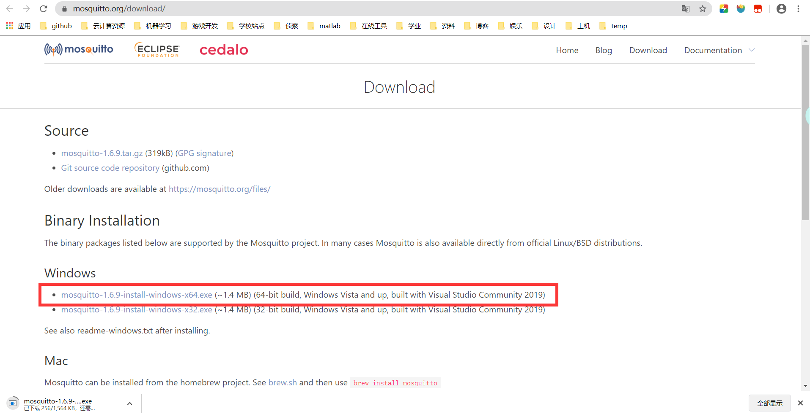
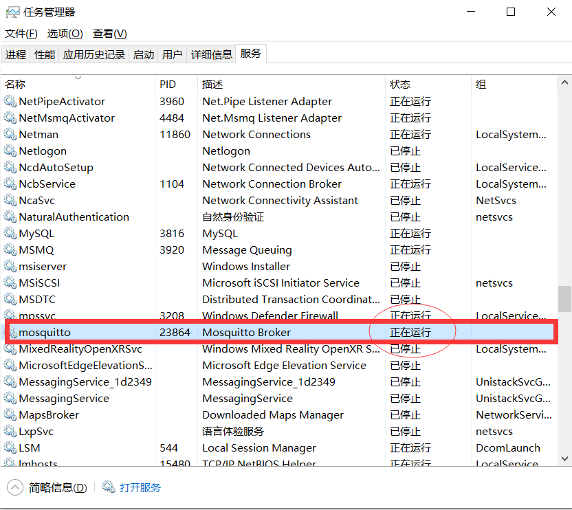

# IOTSensorSystem
**物联网mqtt协议，模拟机房传感器数据存入数据库**

+ **运行环境：**

win10+mysql服务器（云端）+python3

+ **其他环境配置：**

  1. mqtt协议服务器的Windows版安装：

     登录mosquitto.org网站，选择下载对应的版本。

     

     按照其提示步骤安装完毕后，进行windows服务管理开启服务：

     

  2. python3相关的库：

     ```shell
     pip3 install mysqlclient
     pip3 install paho-mqtt python-etcd
     ```

     

+ **代码文件说明：**

  1. Sensor.py:传感器模拟，生成数据（主机信息、温度、湿度、人数），并传送到mqtt服务器上。
  2. DataTransferSystem.py:将mqtt服务器上的数据取出，根据topic进行分类处理，注入到云端数据库。
  3. databasetest.py:顾名思义，用来测试与云端数据库连接与sql语句执行的代码。

+ **邮箱：**

  329201962@qq.com

  


